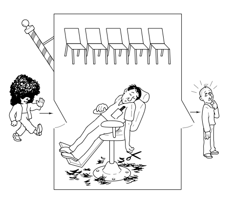

# Problemi progettuali di concorrenza
# - Il barbiere che dorme -
La paternità del problema è attribuita all'informatico olandese
[Edsger Wybe Dijkstra](https://it.wikipedia.org/wiki/Edsger_Dijkstra), viene trattato da [Andrew Tanenbaum](https://it.wikipedia.org/wiki/Andrew_Stuart_Tanenbaum) nel testo
**Modern Operating Systems**.
Si tratta di un problema di comunicazione
e sincronizzazione tra processi.

## Descrizione
Un barbiere possiede un negozio con *una sola poltrona da lavoro* e ed *N sedie
di attesa*. Se non ci sono clienti nel negozio allora il barbiere dorme sulla
poltrona di lavoro.
All'arrivo del primo cliente il barbiere si sveglia ed inizia a servirlo.
Se arrivano clienti durante il periodo di attività del barbiere, essi si mettono
in attesa sui posti disponibili. Se quando un cliente arriva al negozio non ci
sono più sedie di attesa disponibili allora il cliente se ne va.  

## Analisi del problema
Dalla descrizione del problema emergono chiaramente delle entità
modellabili come dei processi:
* **Barber**: processo servente, offre un servizio (taglio di capelli) ai processi
cliente;
* **Customer**: processo cliente.
Altre informazioni riguardanti il problema sono:
* **N sedie di attesa**: individuano un limite massimo di processi accodabili;
* **Poltrona di lavoro**: potrebbe individuare una possibile risorsa.

Nel problema avremo quindi M processi che competono per l'accesso al servizio
offerto dal barbiere, significa che dovremmo garantire ad ogni processo la
possibilità di essere servito in un tempo finito quindi si deve evitare
 *starvation*.

## Soluzione implementata
Nella soluzione implementata sono stati utilizzate 2 tipologie differenti
di semafori:  
1. **Semaforo contatore**: è stato utilizzato per gestire la coda di clienti in
attesa;  
2. **Mutex**: è un semaforo binario, è stato utilizzato per garantire mutua
esclusione (mutex) nei seguenti casi:
  * accesso alla risorsa *negozio del barbiere* da parte del cliente;  
  * per simulare il barbiere che dorme attendendo su un mutex *cliente*.  

Al fine di evitare *starvation* è stata applicata una politica *FIFO* ai
processi in coda per il servizio del barbiere. *FIFO* garantisce
fairness in quanto il primo processo in coda sarà anche il primo ad essere
servito e quindi ad uscire dalla coda.
