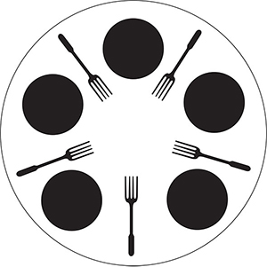

# Problemi progettuali di concorrenza - Filosofi a cena

Il problema è stato delineato dall'informatico olandese
[Edsger Wybe Dijkstra](https://it.wikipedia.org/wiki/Edsger_Dijkstra),
 vincitore del premio Turing nel 1972.  
Si tratta di un problema di controllo della concorrenza, in particolare
si vuole gestire la corretta sincronizzazione delle risorse tra
processi concorrenti.

## Descrizione

5 filosofi sono seduti attorno ad un tavolo circolare.  
Ogni filosofo ha alla sua destra una forchetta e di fronte a sè un piatto.  
Ogni filosofo alterna un periodo in cui medita ad un periodo in cui si nutre.  
Ogni filosofo necessita di 2 forchette per potersi nutrire.  

## Analisi del problema

È facile vedere come ogni filosofo rappresenti un processo
che necessita di determinate condizioni (il possesso di due forchette)
per poter eseguire un determinato compito (mangiare).
Da una breve analisi, considerando che ogni filosofo può utilizzare
solo forchette alla destra e alla sinistra del suo piatto, risulta
che possono essere in esecuzione parallela al più 2 filosofi in uno scenario con 5 filosofi a cena.  
Generalizzando possiamo dire che per n filosofi/processi con n >= 4 la soluzione può diventare in parte parallelizzabile. Si possono avere al più
⌊n/2⌋ in esecuzione parallela, mentre gli altri saranno in esecuzione concorrente.  
In termini di concorrenza si deve trovare una soluzione che:
* Eviti deadlock;
* Eviti starvation;
* Eviti attese attive.

## Soluzione limite - Algoritmo di Peterson

Una possibile soluzione al problema consiste nell'applicazione
dell'[algoritmo di Peterson](https://it.wikipedia.org/wiki/Algoritmo_di_Peterson).
L'algoritmo di Peterson generalizzato viene indicato come *Filter Algorithm*.

## Considerazioni sull'algoritmo di Peterson

Questa soluzione risolve deadlock e starvation.  
Tuttavia non risolve il problema dell'attesa attiva in quanto
ogni processo impegna la CPU anche quando non è in esecuzione.

## Soluzione implementata

La soluzione implementata prende il lock utilizza un monitor (TableMonitor) che permette di parallelizzare la soluzione per ⌊n/2⌋ processi evitando starvation, deadlock ed attesa attiva.
Questo si ottiene prendendo il lock sulle coppie di forchette.
