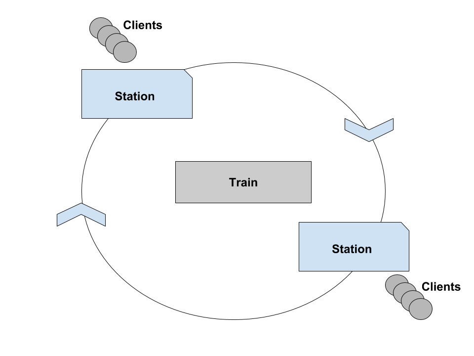

# Problemi progettuali di concorrenza
# - Metro -

Si vuole modellare un sistema di trasporto su un percorso circolare (ring)
composto da:
* Treno: trasporta i viaggiatori da una stazione all'altra, possiede una
capacita' limitata;  
* Stazioni: esistono N stazioni, il treno si ferma nelle stazioni per far scendere
e far salire i viaggiatori;  
* Clienti: esistono K clienti, i clienti utilizzando la stazione salgono e
scendono dal treno. Ogni cliente, dopo ogni viaggio, impiegherà del tempo per
riposarsi dal viaggio.

## Rappresentazione del sistema Metro

