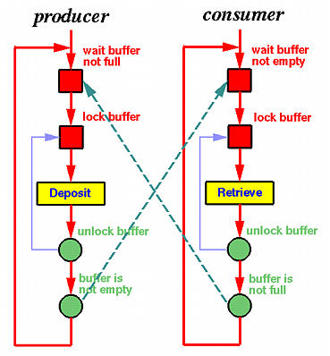

# Problemi progettuali di concorrenza
# - Produttore e consumatore -

Si tratta di un classico problema di sincronizzazione tra processi nell'accesso ad una risorsa condivisa (in questo caso un buffer).  
Il problema viene descritto dal professor [Andrew Tanenbaum](https://it.wikipedia.org/wiki/Andrew_Stuart_Tanenbaum) nel testo
**Modern Operating Systems**

## Descrizione

 Il problema descrive due processi, uno produttore ed uno consumatore, che condividono un buffer di dimensione fissata. Compito del produttore è generare continuamente dati e depositarli nel buffer condiviso. Contemporaneamente, il consumatore utilizzerà i dati prodotti, rimuovendoli di volta in volta dal buffer. Il problema è assicurare che il produttore non elabori nuovi dati se il buffer è pieno, e che il consumatore non cerchi dati se il buffer è vuoto.  
 Una soluzione errata del problema "Produttore e consumatore" potrebbe dare luogo a **deadlock** portando ogni processo ad attendere signal da parte dell'altro.  

## Soluzione

La soluzione implementata risolve il problema "Produttore e consumatore" generalizzato ad N produttori ed N consumatori.    
La soluzione utilizza un **monitor** per garantisce mutua esclusione nell'accesso alla risorsa da parte dei processi.
